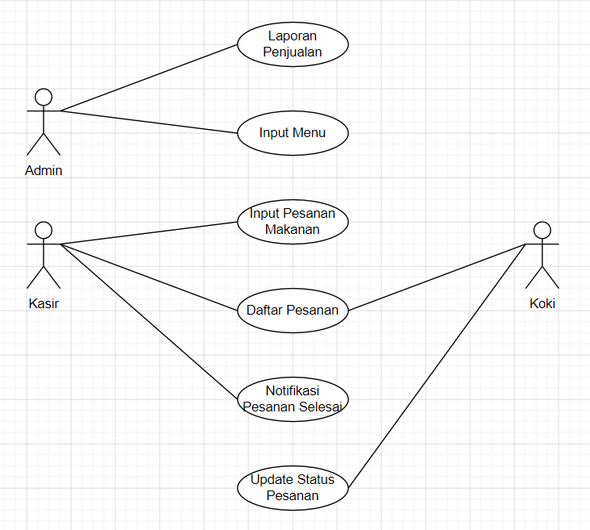

# SmartQueue POS

Sistem Kasir dan Manajemen Pesanan UMKM Berbasis Web dengan Arsitektur Offline First dan Realtime Queue Management.

---

## Deskripsi

SmartQueue POS merupakan sistem kasir berbasis web yang dirancang untuk membantu UMKM kuliner dalam mengelola pesanan pelanggan secara lebih efisien, terstruktur, dan minim kesalahan.

Sistem ini menggantikan pencatatan manual menggunakan kertas yang sering menyebabkan urutan pengerjaan makanan tidak sesuai dengan waktu pemesanan. Dengan SmartQueue POS, kasir mencatat pesanan secara elektronik dan koki dapat melihat antrean pesanan secara realtime berdasarkan urutan pemesanan.

---

## Use Case Diagram

---

## Fitur Utama

### 1. Authentication
Sistem autentikasi untuk mengamankan akses berdasarkan peran pengguna.

- Login dan Logout
- Role Based Access Control (Admin, Kasir, Koki)

### 2. Input Menu
Pengelolaan data menu makanan dan minuman yang tersedia.

- Tambah menu baru
- Edit informasi menu
- Hapus menu

### 3. Input Pesanan Makanan
Kasir dapat membuat pesanan pelanggan dengan mudah dan cepat.

- Membuat pesanan baru
- Menambahkan item menu ke pesanan
- Mengubah jumlah item
- Menghapus item dari pesanan
- Sistem otomatis menghasilkan nomor antrean

### 4. Daftar Pesanan
Menampilkan seluruh pesanan yang masuk secara realtime.

- Melihat seluruh antrean pesanan
- Melihat detail pesanan
- Filter pesanan berdasarkan status (Menunggu, Sedang Dimasak, Selesai)

### 5. Update Status Pesanan
Koki dapat memperbarui status pesanan sesuai progres pengerjaan.

- Mengubah status menjadi "Sedang Dimasak"
- Mengubah status menjadi "Selesai"
- Update status secara realtime ke semua pengguna

### 6. Notifikasi Pesanan Selesai
Kasir menerima notifikasi secara realtime ketika pesanan selesai dimasak.

- Notifikasi realtime via Socket.IO
- Kasir dapat langsung memanggil pelanggan

### 7. Laporan Penjualan
Dashboard ringkasan aktivitas dan statistik penjualan harian.

- Total pesanan hari ini
- Total pendapatan hari ini
- Jumlah pesanan menunggu, sedang dimasak, dan selesai

### 8. Offline First
Sistem tetap dapat digunakan ketika koneksi internet tidak stabil atau terputus.

- Data disimpan ke IndexedDB saat offline
- Sinkronisasi otomatis saat internet kembali
- Tidak ada pesanan yang hilang

---

## Role Pengguna

| Role | Akses |
|------|-------|
| **Admin** | Input Menu, Laporan Penjualan, Daftar Pesanan |
| **Kasir** | Input Pesanan, Daftar Pesanan, Notifikasi Pesanan Selesai |
| **Koki** | Daftar Pesanan, Update Status Pesanan, Input Pesanan |

---

## Tech Stack

| Layer | Teknologi |
|-------|-----------|
| Frontend | React.js, React Router DOM, Axios, Context API / Zustand, IndexedDB |
| Backend | Node.js, Express.js, JWT Authentication, bcrypt |
| Database | Supabase PostgreSQL |
| Realtime | Socket.IO |
| Deployment | Vercel (Frontend), Railway / Render (Backend), Supabase (Database) |

---

## Alur Sistem

1. Kasir membuat pesanan
2. Sistem membuat nomor antrean otomatis
3. Data pesanan tersimpan
4. Pesanan muncul pada dashboard koki
5. Koki mulai memasak dan update status menjadi "Sedang Dimasak"
6. Setelah selesai, status berubah menjadi "Selesai"
7. Kasir menerima notifikasi realtime
8. Kasir memanggil pelanggan
